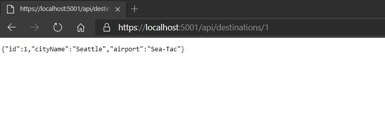
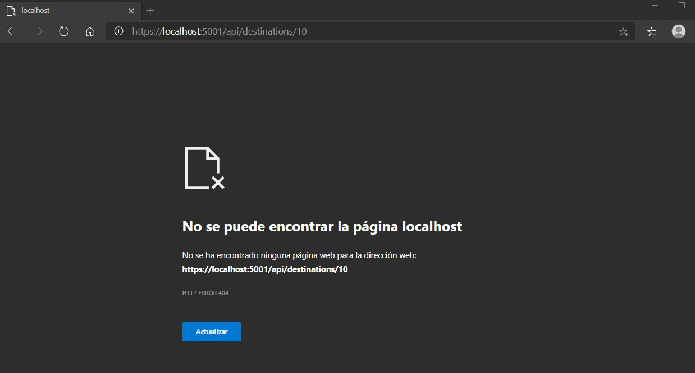

# Module 3: Creating and Consuming ASP.NET Core Web APIs

# Lesson 4: Handling HTTP Requests and Responses

### Demonstration: Throwing Exceptions

- Abrimos el proyecto ThrowHttpResponseException en Visual Studio Code 

- Añadimos la accion Get con un ID en el **DestinationsController.cs**

- Ejecutamos 

- Abrimos el navegador con la siguiente url

  

  ```url
  https://localhost:5001/api/destinations/1
  ```

  



- SI en el navegador introducimos un ID que no existe se dispara el error

```url
https://localhost:5001/api/destinations/10
```


